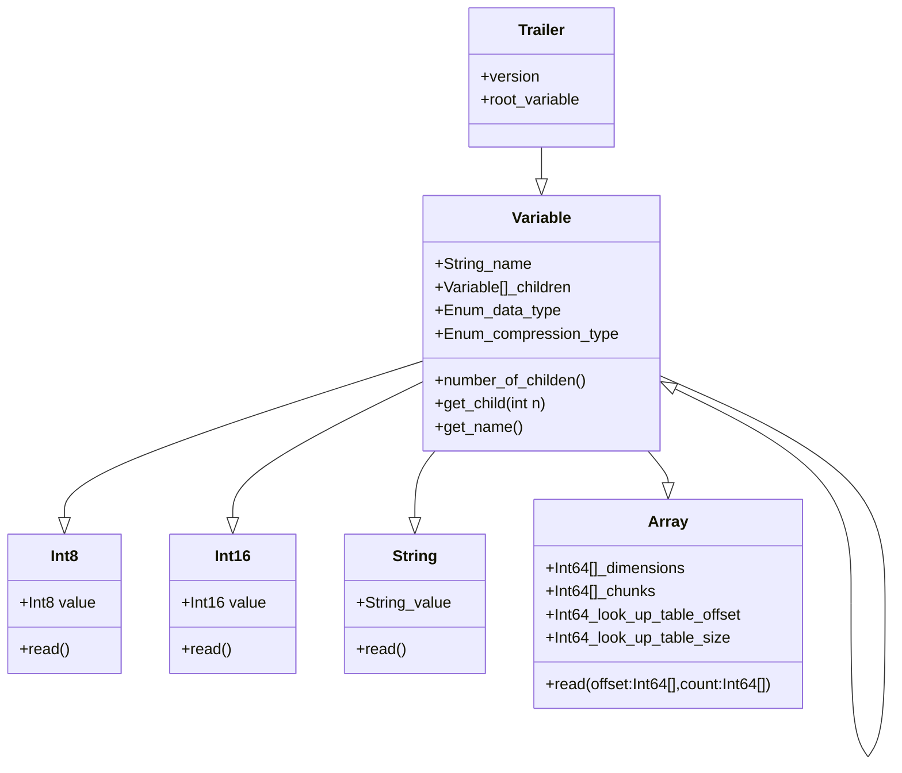

# OM-File-Format library

 

The Open-Meteo OM-File format is designed for efficient storage and distribution of multi-dimensional environmental data. By chunking, compressing, and indexing the data, OM-Files enable cloud-native random reads while minimizing file sizes. The format supports hierarchical data structures similar to NetCDF or HDF5.

This library implements the format in C, with a high-level Swift abstraction integrated directly into the Open-Meteo weather API. Future bindings for Python, TypeScript, and Rust are planned.

**Note**: This library is in a highly experimental stage. While Open-Meteo has used the format for years, this standalone library was initiated in October 2024 to provide Python bindings. We aim to provide a robust Python library to access the [Open-Meteo weather database](https://github.com/open-meteo/open-data) provided on S3 through an AWS open-data sponsorship.

### Features:
- **Chunked, compressed multi-dimensional arrays**
- **High-speed integer compression:** Based on [FastPFOR](https://github.com/fast-pack/FastPFor) with SIMD instructions for compression rates in the GB/s range
- **Lossless and lossy compression:** Adjustable accuracy via scale factors
- **Optimized for cloud-native random IO access:** Supports IO merging and splitting
- **Sequential file writing:** Enables streaming to cloud storage; metadata is stored at the file’s end
- **Sans-IO C implementation:** Designed for async support and concurrency in higher-level libraries

### Core Principles:
- **Chunked Data Storage:** OM-Files partition large data arrays into individually compressed chunks, with a lookup table tracking chunk positions. This allows reading and decompressing only the required chunks—ideal for use cases like meteorological datasets, where users often query specific regions rather than global data.
- **Optimized for Meteorological Use Cases:** Example: In weather reanalysis (e.g., Copernicus ERA5-Land), global datasets at 0.1° spatial resolution can reach massive scales. A single timestep with 3600 x 1800 pixels (~25 MB using 32-bit floats) grows to 211.5 GB for one year of hourly data (8760 hours). Over decades, and across thousands of variables, datasets easily reach petabyte scales. Traditional GRIB files, while efficient for compression, require decompressing the entire file to access specific subsets. OM-Files, on the other hand, allow direct access to localized data (e.g., a single country or city) by leveraging small chunk sizes (e.g., 3 x 3 x 120).
- **Improved Compression Efficiency:** Chunking exploits spatial and temporal data correlations to enhance compression. Weather data, for instance, shows gradual changes across locations and time. Optimal chunking dimensions (compressing 1,000–2,000 values per chunk with a last dimension >100) strike a balance between compression efficiency and performance. Too many chunks reduce both.
- **High-Speed Data Access:** OM-Files minimize data transfer and decompression overhead, enabling extremely fast reads while maintaining strong compression ratios. This powers the Open-Meteo weather API to deliver forecasts in sub-millisecond speeds and enables large-scale data analysis without requiring users to download hundreds of gigabytes of GRIB files.

### ToDo:
- Document Swift functions
- Document C functions
- Support for string attributes and string-arrays
- Build Python library
- Examples how to use Python FSSPEC with cache to access OM-Files on S3
- Build web-interface to make the entire Open-Meteo weather database accessible with automatic Python code generation

### Swift Library Interface
Swift code can be found in [./Swift](./Swift/) with tests in [./Tests](./Tests/)

TODO: Document functions + example

### C Library Interface
The C code is available in [/c](./c/)

TODO document C functions

### Data hierarchy model:
- The file trailer contains the position of the root variable
- Each variable has a datatype and datatype dependent payload. E.g. Number has the number as payload. An array has the look-up-table position and the compressed data section as array
- Each variable has a name
- Each variable has 0...N variables -> This is basically a graph designed to be used as a key-value tree. Similar to HDF5 but variables and attributes are mixed

Legacy Binary Format: 
- Int16: magic number "OM"
- Int8: version
- Int8: compression type with filter
- Float32: scalefactor
- Int64: dim0 dim (slow)
- Int64: dim0 dim1 (fast)
- Int64: chunk dim0
- Int64: chunk dim1
- **Array of 64-bit Integer: Offset lookup table**
- **Blob: Data for each chunk, offset but the lookup table**

New Binary Format:
- Int16: magic number "OM"
- Int8: version (now version 3)
- Blob: Compressed data and lookup table LUT
- Blob: Binary encoded variables
- Int16: magic number "OM"
- Int8: version (now version 3)
- Int64: Offset of root variable
- Int64: Size of root variable

Binary representation:
- File header with magic number and version
- File trailer with offsets and size of the root variable
- Variable has attributes: date type (8bit), compression type (8bit), size_of_name (16bit), count_of_attributes (32bit)
- Depending on data type followed by payload for a given data type
- Followed by the name as string, and for each attribute the offset and size
- Typically all compressed data is in the beginning of the file, followed by all meta data and attributes (streaming write without ever seeking back!)

Header message (Note: Legacy files also encode attributes for a 2 dimensional header here)
<table><thead>
  <tr>
    <th>Byte 1</th>
    <th>Byte 2</th>
    <th>Byte 3</th>
    <th>Byte 4</th>
    <th>Byte 5</th>
    <th>Byte 6</th>
    <th>Byte 7</th>
    <th>Byte 8</th>
  </tr></thead>
<tbody>
  <tr>
    <td colspan="2">Magic number "OM"</td>
    <td>Version</td>
  </tr>
</tbody></table>

Trailer message:
<table><thead>
  <tr>
    <th>Byte 1</th>
    <th>Byte 2</th>
    <th>Byte 3</th>
    <th>Byte 4</th>
    <th>Byte 5</th>
    <th>Byte 6</th>
    <th>Byte 7</th>
    <th>Byte 8</th>
  </tr></thead>
<tbody>
  <tr>
    <td colspan="2">Magic number "OM"</td>
    <td>Version</td>
    <td>Reserved</td>
  </tr>
  <tr>
    <td colspan="8">Size of Root Variable</td>
  </tr>
  <tr>
    <td colspan="8">Offset of Root Variable</td>
  </tr>
</tbody></table>

Variable message:
<table><thead>
  <tr>
    <th>Byte 1</th>
    <th>Byte 2</th>
    <th>Byte 3</th>
    <th>Byte 4</th>
    <th>Byte 5</th>
    <th>Byte 6</th>
    <th>Byte 7</th>
    <th>Byte 8</th>
  </tr></thead>
<tbody>
  <tr>
    <td>Data Type</td>
    <td>Compression Type</td>
    <td colspan="2">Size of name</td>
    <td colspan="4">Number of Children</td>
  </tr>
  <tr>
    <td colspan="8">Size of Value / LUT (only arrays and strings)</td>
  </tr>
  <tr>
    <td colspan="8">Offset of Value / LUT (only arrays)</td>
  </tr>
  <tr>
    <td colspan="8">Number of Dimensions (only arrays)</td>
  </tr>
  <tr>
    <td colspan="4">Scale Factor (float, only arrays)</td>
    <td colspan="4">Add Offset (float, only arrays)</td>
  </tr>
  <tr>
    <td colspan="8">N * Size of Child</td>
  </tr>
  <tr>
    <td colspan="8">N * Offset of Child</td>
  </tr>
  <tr>
    <td colspan="8">N * Dimension Length (only arrays)</td>
  </tr>
  <tr>
    <td colspan="8">N * Chunk Dimension Length (only arrays)</td>
  </tr>
  <tr>
    <td colspan="8">Bytes of value (scalar, string, not arrays)</td>
  </tr>
  <tr>
    <td colspan="8">Byte of name</td>
  </tr>
</tbody></table>

